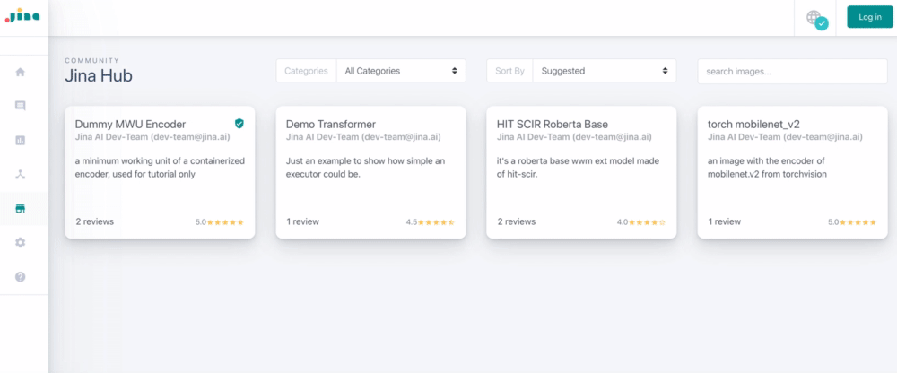

# Jina Hub (beta)

[](https://github.com/jina-ai/hub-builder/actions?query=workflow%3Aon-release)
[](https://github.com/jina-ai/hub-builder/actions?query=workflow%3Anightly)
[](https://hubstatus.jina.ai)
[](#license)
[](https://docs.jina.ai)
[](https://jobs.jina.ai)
<a href="https://twitter.com/intent/tweet?text=%F0%9F%91%8DCheck+out+Jina%3A+the+New+Open-Source+Solution+for+Neural+Information+Retrieval+%F0%9F%94%8D%40JinaAI_&url=https%3A%2F%2Fgithub.com%2Fjina-ai%2Fjina&hashtags=JinaSearch&original_referer=http%3A%2F%2Fgithub.com%2F&tw_p=tweetbutton" target="_blank">
  </img>
</a>

Jina Hub is an open-registry for hosting immutable Jina components via container images. It enables users to ship, and exchange their best-practice across various Jina search applications.



<!-- START doctoc generated TOC please keep comment here to allow auto update -->
<!-- DON'T EDIT THIS SECTION, INSTEAD RE-RUN doctoc TO UPDATE -->


- [Build Your Pod into a Docker Image](#build-your-pod-into-a-docker-image)
  - [Goal](#goal)
  - [Why?](#why)
  - [What Should be in the Image?](#what-should-be-in-the-image)
  - [Step-by-Step Example](#step-by-step-example)
- [Use Your Pod Image](#use-your-pod-image)
  - [Use the Pod image via Docker CLI](#use-the-pod-image-via-docker-cli)
  - [Use the Pod image via Jina CLI](#use-the-pod-image-via-jina-cli)
  - [Use the Pod image via Flow API](#use-the-pod-image-via-flow-api)
- [Publish Your Pod Image to Jina Hub](#publish-your-pod-image-to-jina-hub)
  - [What Files Need to be Uploaded?](#what-files-need-to-be-uploaded)
  - [Schema of `manifest.yml`](#schema-of-manifestyml)
  - [Steps to Publish Your Image](#steps-to-publish-your-image)
  - [Why My Upload Fails on the CICD?](#why-my-upload-fails-on-the-cicd)
- [Contributing](#contributing)
- [License](#license)

<!-- END doctoc generated TOC please keep comment here to allow auto update -->

### Installing dependencies

```bash
pip install -r builder/requirements.txt
pip install jina[devel]
```

### Building images

For building single image:

```bash
app.py --target=hub/examples/mwu_encoder
```

For building all images:

```bash
app.py --update-strategy=force
```

Flags:

`--bleach-first`: to remove all existing docker instances before build
`--target=`: is a path to single image to be builded
`--push`: to push successfully builded image to docker hub. Credentials as `DOCKERHUB_DEVBOT_USER` and `DOCKERHUB_DEVBOT_USER` are required.
`--test`: to test images with `docker run`, `jina pod`, and Jina Flow.


### Why My Upload Fails on the CICD?

Here is the checklist to help you locate the problem.

- [ ] Required file `Dockerfile`, `manifest.yml`, `README.md` is missing. 
- [ ] The required field in `manifest.yml` is missing.
- [ ] Some field value is not in the correct format, not passing the sanity check.
- [ ] The pod bundle is badly placed.
- [ ] Time of building + testing is longer than 10 minutes. 
- [ ] The build is successful but it fails on [three basic usage tests](#use-your-pod-image).

Click "Details" and checkout the log of the CICD pipeline:


## Contributing

We welcome all kinds of contributions from the open-source community, individuals and partners. Without your active involvement, Jina won't be successful.

Please first read [the contributing guidelines](https://github.com/jina-ai/jina/blob/master/CONTRIBUTING.md) before the submission. 

## License

Copyright (c) 2020 Jina AI Limited. All rights reserved.

Jina is licensed under the Apache License, Version 2.0. [See LICENSE for the full license text.](LICENSE)
