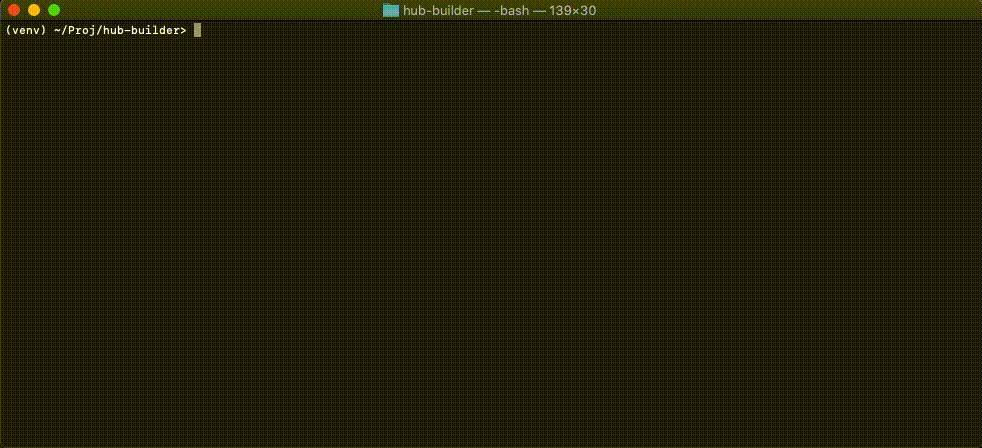

# Jina Hub Builder (beta)

[](https://github.com/jina-ai/hub-builder/actions?query=workflow%3Aon-release)
[](https://github.com/jina-ai/hub-builder/actions?query=workflow%3Anightly)
[](https://hubstatus.jina.ai)
[](#license)
[](https://docs.jina.ai)
[](https://jobs.jina.ai)
<a href="https://twitter.com/intent/tweet?text=%F0%9F%91%8DCheck+out+Jina%3A+the+New+Open-Source+Solution+for+Neural+Information+Retrieval+%F0%9F%94%8D%40JinaAI_&url=https%3A%2F%2Fgithub.com%2Fjina-ai%2Fjina&hashtags=JinaSearch&original_referer=http%3A%2F%2Fgithub.com%2F&tw_p=tweetbutton" target="_blank">
  </img>
</a>

Jina Hub Builder is an app for building user generated pod images, testing and publishing them on Docker Hub.




<!-- START doctoc generated TOC please keep comment here to allow auto update -->
<!-- DON'T EDIT THIS SECTION, INSTEAD RE-RUN doctoc TO UPDATE -->


- [Installing dependencies](#installing-dependencies)
- [Building images](#building-images)
  - [Flags:](#flags)
- [Outputs](#outputs)
- [Contributing](#contributing)
- [License](#license)

<!-- END doctoc generated TOC please keep comment here to allow auto update -->


## Installing dependencies

To build images with this builder app, first you have to install some required dependencies and repos.

```bash
➜ git clone https://github.com/jina-ai/hub-builder ./builder // installing the builder core
➜ git clone https://github.com/jina-ai/jina-hub ./builder/hub // installing hub containing current stable images
➜ git clone https://github.com/jina-ai/jina ./builder/src/jina // installing jina core
➜ git clone https://github.com/jina-ai/hub-status ./builder/status // installing status path
➜ cd builder
➜ pip install -r builder/requirements.txt
➜ pip install jina[devel]
```

## Building images

For building single image:

```bash
➜ python app.py --target=hub/examples/mwu_encoder
```

For building all images:

```bash
➜ python app.py --update-strategy=force
```

### Flags:

- [ ] `--bleach-first`: to remove all existing docker instances before build
- [ ] `--target`: is a path to single image to be builded
- [ ] `--push`: to push successfully builded image to docker hub. Credentials as `DOCKERHUB_DEVBOT_USER` and `DOCKERHUB_DEVBOT_USER` as env variables are required.
- [ ] `--test`: to test images with `docker run`, `jina pod`, and Jina Flow.
- [ ] `--reason`: to set a reason for current build (would be added to status readme)
- [ ] `--check-targets`: to check if some images-related files were modified but with no rebuild
- [ ] `--update-strategy`: is a level of current rebuild importance. If specified to `force`, rebuilds all images. More detailed description regarding update policy [is here.](https://github.com/jina-ai/jina-hub#remarks-on-the-update-policy)

If you wish your Mongo database to track build history, you should add database connection on app call. 
Execute `MONGODB_CREDENTIALS={user:password} app.py ...` instead of using `app.py ...`.

When you start the app, you may lines like this:
`Found target file /Users/user/builder/hub/hub/executors/encoders/image/torchvision-mobilenet_v2/Dockerfile`
This means the file was modified from it's last git-committed state. 
All images having proper `update` field specified in their `manifest.yml` will be updated according to selected `--update-strategy` on the `app.py` run. More detailed description regarding update policy [is here.](https://github.com/jina-ai/jina-hub#remarks-on-the-update-policy)

## Outputs

When the image build is finished, you will see message like
```
Successfully built image hub.executors.encoders.nlp.transformers-pytorch
```
This means you image is successfully built. Otherwise, you see an error description in your terminal output.
If you have `--push` option on application run, all successfully built images will be pushed to docker hub.

When the app run is finished (only if you built multiple targets and did not specified `--target` flag), you will see lines like
```
Hub readme updated successfully on path /Users/user/hub-builder/status/README.md
Hub badge updated successfully on path /Users/user/hub-builder/status/hub-stat.svg
```
This means the app has just updated status Readme.md and hub badge.

If you run the app with database connection (with `MONGODB_CREDENTIALS` specified), you will see a message:
```
Hub history updated successfully on database
```
The next lines:
```
Package api updated on path /Users/user/hub-builder/api/hub/package
Status api updated on path /Users/user/hub-builder/api/hub/status
```
mean that the app produced fresh json tracks which could be used for status and building state analysis. See [here](https://github.com/jina-ai/api#jina-hub-status) for more details.

## Contributing

We welcome all kinds of contributions from the open-source community, individuals and partners. Without your active involvement, Jina won't be successful.

Please first read [the contributing guidelines](https://github.com/jina-ai/jina/blob/master/CONTRIBUTING.md) before the submission. 

## License

Copyright (c) 2020 Jina AI Limited. All rights reserved.

Jina is licensed under the Apache License, Version 2.0. [See LICENSE for the full license text.](LICENSE)
